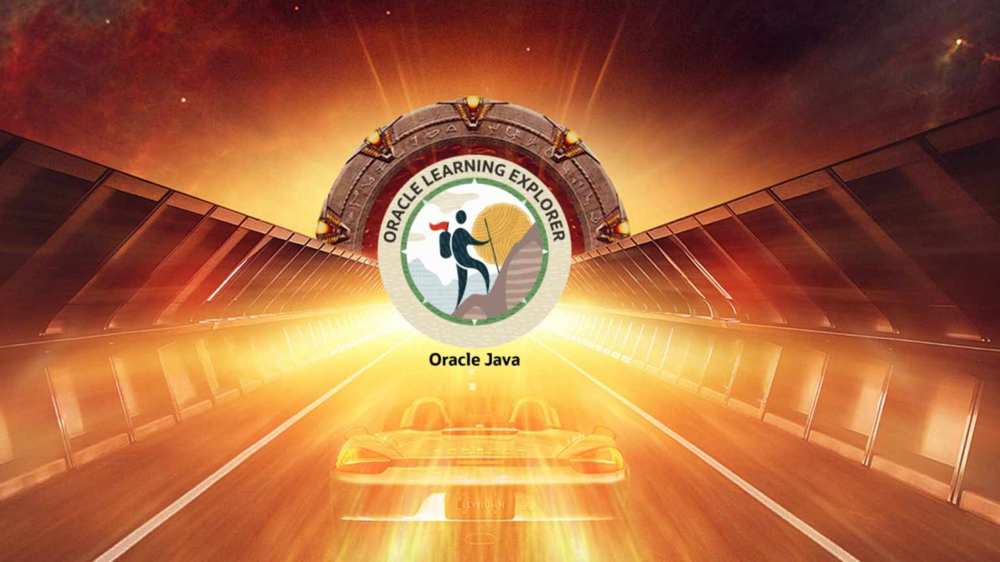

# Ahmed Samy 
## Senior Software Engineer at EPAM Systems, Poland

<!-- ======== Icons Section ======== -->
 

<!-- ======== Body Section ======== -->

- 🔭 I’m currently working on Level up
- 🌱 I’m currently learning different technology in full Stack roadmap
- 👯 I’m looking to collaborate on making our world a better place <!-- - 🤔 I’m looking for help with ... -->
- 💬 Ask me about anything you like
- 📫 How to reach me: mu contacts above
- ⚡ Fun fact: ask me ;)

